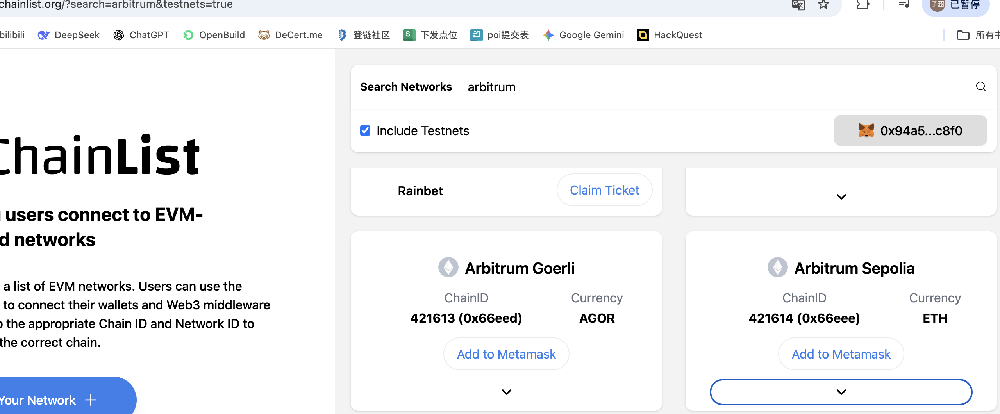
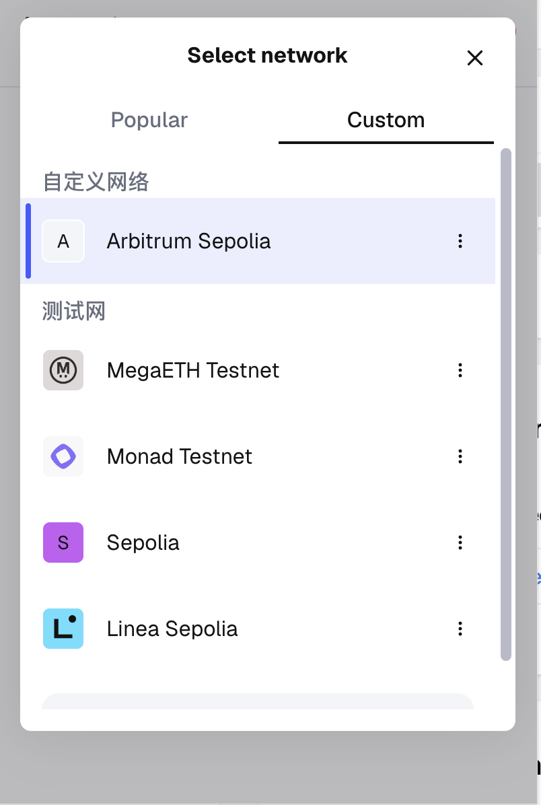
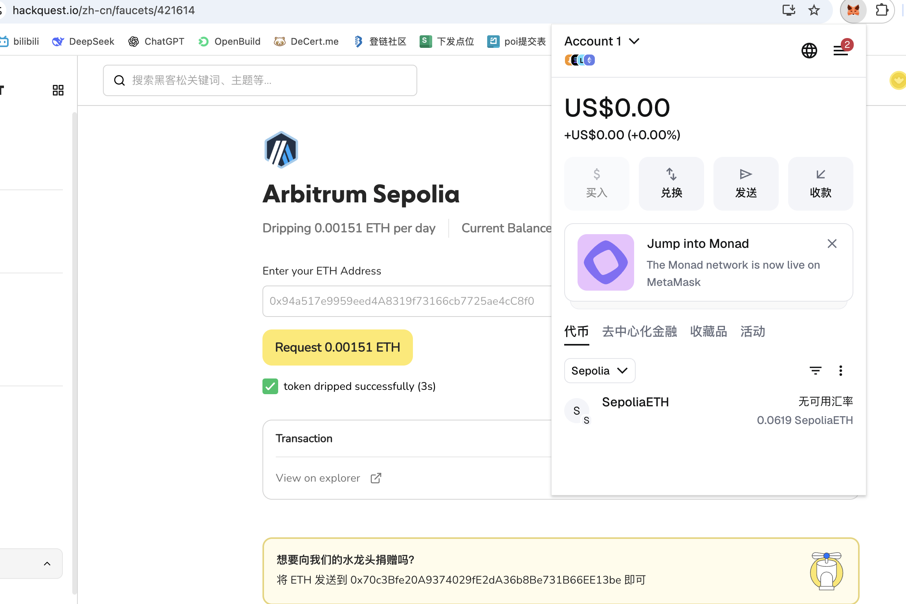
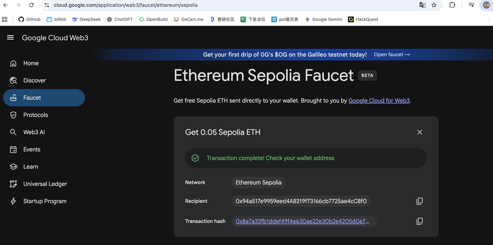
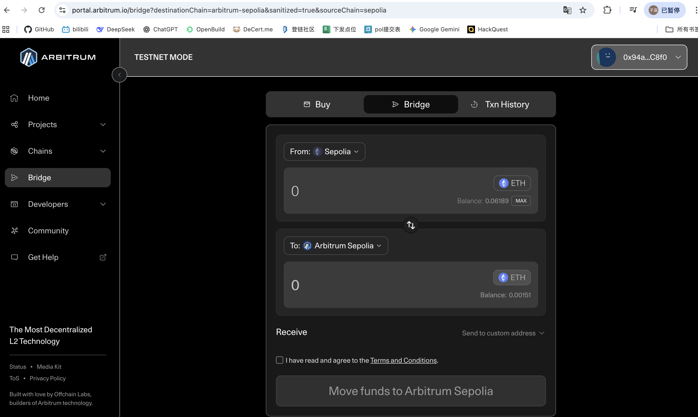
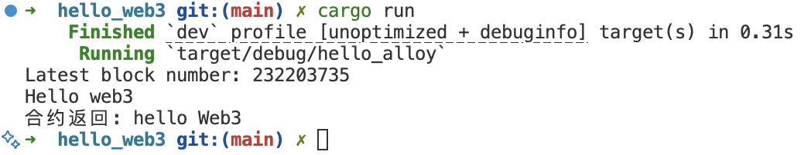

# arbitrum-rust-colearning-0xBrick
task1  hello_web3 

# 操作步骤  连接arbitrum sepolia测试网
先进入https://chainlist.org/?search=arbitrum&testnets=true  
将Arbitrum Sepolia网络添加至metamask

然后可以在metamask中选择arbitrum sepolia测试网

# 操作步骤  领取测试币

方法一：hackquest官网领取测试币
https://www.hackquest.io/zh-cn/faucets/421614
填写以太坊钱包地址即可领取

方法二：以太坊Sepolia测试币跨链兑换Arbitrum Sepolia测试币
首先领取以太坊Sepolia测试币
https://cloud.google.com/application/web3/faucet/ethereum/sepolia

跨链桥将 Etherum Sepolia测试币 兑换为 Arbitrum Sepolia测试币
https://portal.arbitrum.io/bridge

task1 hello web3 程序运行结果
