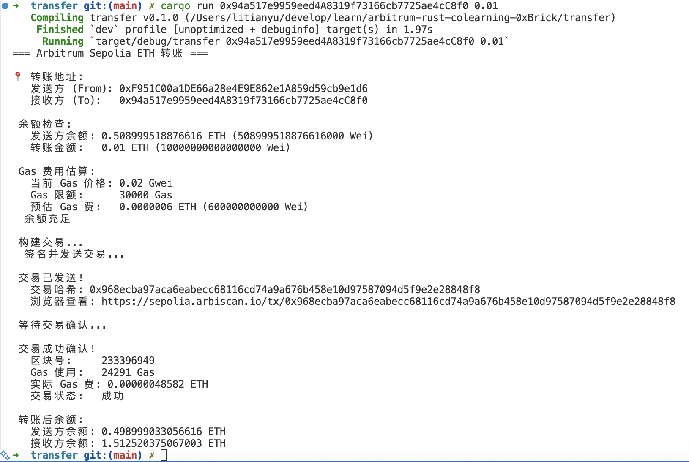
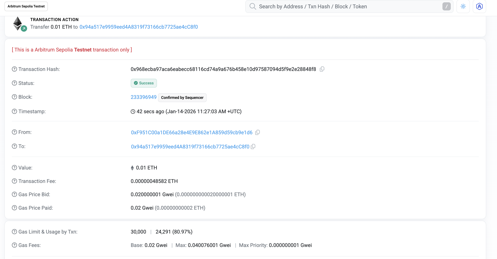

# Arbitrum Sepolia 测试网 ETH 转账

基于 alloy 实现的完整 Arbitrum 测试网 ETH 转账脚本。

### 配置私钥
创建 `.env` 文件（基于 `.env.example`）：
cp .env.example .env
编辑 `.env` 文件，填入私钥：
PRIVATE_KEY=0x你的私钥（不要泄露！）

### 基本用法

cargo run <接收地址> <转账金额ETH>

### 示例

转账 0.0001 ETH：
cargo run 0x1234567890123456789012345678901234567890 0.0001

### 截图

